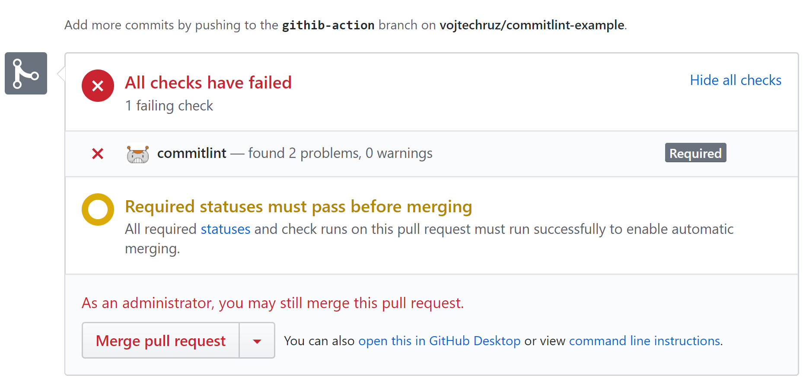
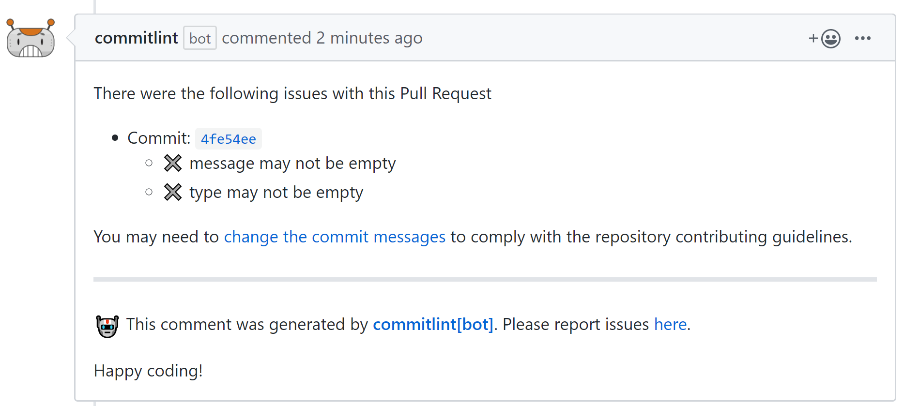

Automatically check and enforce your commit conventions either with various available configurations.

## Commit conventions
Although you can put pretty much anything in your commit messages, it is beneficial to have more standardized and structured approach. It is better to stick to a convention, so all your commit messgaes follow the same structure. This has many advantages.

- Your commit history is more readable and easier to navigate
- You can automatically generate changelogs
- Based on type of changes you can properly bump your version when using [samentic versioning](https://semver.org/): 
  - major: when introducing breaking chnages 
  - minor: when adding a feature
  - fix: when adding a fix

There are various conventions, one example can be [Conventional Commits](https://www.conventionalcommits.org/).

Conventions can be very useful, but only as long as you can make sure everybody follows them. You can rely on your developers discipline, but it is risky. Especially with external contributors to your codebase who may not be familiar enough with your convention. What's much better is having an automated tool to check your commits for you and reject them if they don't follow your conventions.

## Githooks & Husky
Fortunately, Git already allow you to perform some actions when specific events are triggered. It is called git hooks. You can react in many phases of the git workflow such as:

- pre-commit
- pre-push
- pre-rebase
- post-update

The bad news is that this is configured locally in your `.git` directory, so by default each developer needs to be sure to install their hooks. If they don't, there are no checks and you cannot check your conventions.

Fortunately, there is a tool called Husky for Node/NPM projects, which solves this issue. You can define your hooks in your project and they are automatically installed for you when running the project. This way all the developers will have proper hooks installed with no effort. If you need to change your hooks, you can do it n just one place, and it gets propagated to all your developers. You can read more about Husky in one of my previous posts:

<div class="linked-article"><h4 class="front-post-title" style="margin-bottom: 0.375rem;"><a href="/githooks-husky/" style="box-shadow: none;">Easy git hooks with Husky</a></h4><small class="front-post-info"><span class="front-post-info-date">21 June, 2018</span><div class="post-tags"><ul><li><a href="/tags/git/">#Git</a></li></ul></div></small><div><a class="front-post-image" href="/githooks-husky/"><div class=" gatsby-image-wrapper" style="position: relative; overflow: hidden;"><div style="width: 100%; padding-bottom: 66.6875%;"></div><picture><source srcset="/linked/husky/5e4a3/husky.jpg 45w,
/linked/husky/e451c/husky.jpg 90w,
/linked/husky/29fd0/husky.jpg 180w,
/linked/husky/b3ebb/husky.jpg 270w,
/linked/husky/8841e/husky.jpg 360w,
/linked/husky/989b1/husky.jpg 1600w" sizes="(max-width: 180px) 100vw, 180px"></picture><noscript><picture><source srcset="/linked/husky/5e4a3/husky.jpg 45w,
/linked/husky/e451c/husky.jpg 90w,
/linked/husky/29fd0/husky.jpg 180w,
/linked/husky/b3ebb/husky.jpg 270w,
/linked/husky/8841e/husky.jpg 360w,
/linked/husky/989b1/husky.jpg 1600w" sizes="(max-width: 180px) 100vw, 180px" /></picture></noscript></div></a><span class="front-post-excerpt">Effortless creation and management of git hooks for your Node/NPM projects with Husky.</span></div></div>

While Husky can be used to enforce your commit conventions, it can do much more. You can run your static code analysis, tests, automatic code formatting and much more when commiting.

## Commitlint
Commitlint is an automated tool which can check your commit conventions for you and reject the commit if it does not follow your rules. These rules, of course, can be configured. Under the hood, Commitlint uses Husky git hooks.

## Local setup

### Husky
Since Commitlint utilizes Husky, we need to install it first. Husky is provided as dev-dependency, so it is used only locally and not bundled with your production code.

```
npm install --save-dev husky
```

Now we need to register a hook for checking a commit message. The hook is called `commit-msg` and can be registered in your `package.json`.

```
{
  "husky": {
    "hooks": {
      "commit-msg": "commitlint -E HUSKY_GIT_PARAMS"
    }  
  }
}
```

Alternatively, you can use a dedicated `.huskyrc` file, which contains only Husky configuration:

```
{
  "hooks": {
    "commit-msg": "commitlint -E HUSKY_GIT_PARAMS"
  }
}
```

### Commitlint
Now when We have Husky, we need to install Commitlint CLI, which will be executed by Husky hook to validate commit messages. Again, it is jsut a dev dependency, which is not included in your production bundle.

```
npm install --save-dev @commitlint/cli
```

### Convention configuration
Commitlint is just a tool for checking if your messages follow your conventions. It does not for you to use a specific convention, you can use whatever you want, it is fully configurable. It offers some configurations out of Currently supported configurations are:

- [@commitlint/config-conventional](https://github.com/conventional-changelog/commitlint/tree/master/%40commitlint/config-conventional)
- [@commitlint/config-lerna-scopes](@commitlint/config-lerna-scopes)
- [@commitlint/config-patternplate](https://github.com/conventional-changelog/commitlint/tree/master/%40commitlint/config-patternplate)
- [@commitlint/config-angular](https://github.com/conventional-changelog/commitlint/tree/master/%40commitlint/config-angular)
- [@commitlint/config-angular-type-enum](https://github.com/conventional-changelog/commitlint/tree/master/%40commitlint/config-angular-type-enum)

Let's use `@commitlint/config-conventional` for now, but the process would be the same for any different configuration. We just need to install the proper package:

```
npm install --save-dev @commitlint/config-conventional
```

The last step is to create a Commitlint configuration file, where you define, which configuration should be used. We'll set up the one we just installed. Create a new file called `commitlint.config.js` in the root directory.

```
module.exports = {
    extends: ['@commitlint/config-conventional']
};
```

### Verifying the setup
Now we're good to go. Let's just make sure everything works. Let's make sure our commit messages are tested against the [Conventional Commits](https://www.conventionalcommits.org/) specification. Let's try an ordidary, not structured commit message first.

```
C:\projects\commitlint-example>git commit -m "created base project structure"
husky > commit-msg (node v10.16.3)
⧗   input: created base project structure
✖   subject may not be empty [subject-empty]
✖   type may not be empty [type-empty]

✖   found 2 problems, 0 warnings
ⓘ   Get help: https://github.com/conventional-changelog/commitlint/#what-is-commitlint

husky > commit-msg hook failed (add --no-verify to bypass)
```

The commit was rejected due to missing subject and type. Let's fix that.

```
git commit -m "feat: created base project structure
```

Now the commit was accepted. We added type of the commit `feat` and the part after the colon `:` is considered subject.

The full structure of conventional commits is the following:

```
<type>[optional scope]: <description>

[optional body]

[optional footer(s)]
```

## Continous Integration
Local setup as described above is necessary and good as a first line of defense. However, it is not bulletproof. Developers can Tinker with the local setup or supress git hooks. You cannot rely purely on local Husky setup. As another line of defense, it is viable to integrate Commitlint with your CI. You can reject invalid commits on the server even if developers manage to sneak them in.

### Travis
Commitlint supports integration with [Travis CI](https://travis-ci.org/). First, elt's create a `.travis.yml` file in your root directory. We need to configure that it should run the Commitlint script.

```yaml
language: node_js
script:
  - commitlint-travis
```

Now we need to install Travis support in our project:

```
npm install --save-dev @commitlint/travis-cli
```

### Commitlint GitHub action
Even simpler alternative to Travis is adding a [GitHub Action](https://github.com/features/actions). [There is an action for Commitlint available](https://probot.github.io/apps/commitlint/).

The setup is super-easy. Yous got to [this page] and click `Install`. You can select whether this action should apply for all your repost or just selected ones. And that's it, now whenever you create a Pull Request, it will be automatically checked by Commitlint.

Now if your PR contains invalid commit messages, the checks will fail:



And you will get a comment explaining all the failures:



## Commit message wizard

### Prompt CLI
[@commitlint/prompt-cli](https://github.com/conventional-changelog/commitlint/tree/master/%40commitlint/prompt-cli)

```
npm install --save-dev @commitlint/prompt-cli
```

Now you can register `commit` command in your `package.json`.

```
{
  "scripts": {
    "commit": "commit"
  }
}
```

Now instead of `git commit` you can run `npm run commit`. It launches an interactive wizard in your console, which will ask you for all the parts of a commit message such as type, subject and so on.

```
Please enter a type: [required] [tab-completion] [header]
<type> holds information about the goal of a change.

<type>(<scope>): <subject>
<body>
<footer>

72 characters left
❯ type:
```

What's cool is that this wizard automatically loads your configuration from your `commitlint.config.js` and behaves based on that config.

### Commitizen
Another option instead of `prompt-cli` is a third-party solution called [Commitizen](http://commitizen.github.io/cz-cli/).

It is also a wizard, which lets you easily create specification-compliant commit messages.

## Example repo
Youcan find an example repository I created with fully set up Commitlint [here](https://github.com/vojtechruz/commitlint-example/). It includes also Travis integration and prompt-cli with examples of rejected PRs.

## Conclusion
Having convention for commit messages has many benefits and you can use many automated tools to utilize that. Automatic generation of changelogs and version bumps are no longer a problem. Not to mention much better readability. Commitlint helps you with that both locally and on your Continous Integration server.

Husky, used by Commit lint is a powerful tool for managing git hooks and can be use not only for commit messages but also for a wide variety of other quality checks.