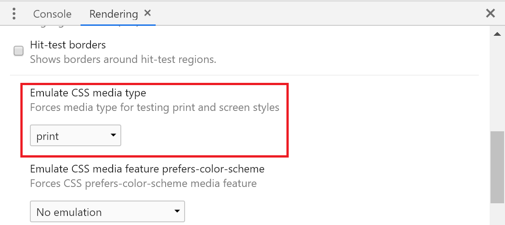

## Adding print stylesheet
When you want to apply certain CSS rules just when printing, you can easily add a separate stylesheet, which will be used just for printing purposes.

```html
<link rel="stylesheet" media="print" href="printing-stylesheet.css">
```

Having separate stylesheet just for printing can be useful, if you want to [load it dynamically](http://www.javascriptkit.com/javatutors/loadjavascriptcss.shtml), only when needed or you prefer your print styles to be completely separated.

## Media queries    
More modern way of including print-specific CSS is using [media queries](https://developer.mozilla.org/en-US/docs/Web/CSS/Media_Queries/Using_media_queries).

You can define that certain set of CSS rules can be applied only when printing.

```css
@media print {
  ...
}
```

Or only when using screen.

```css
@media screen {
  ...
}
```

This approach may be preferred to separate print stylesheet as you can easily have regular and print CSS for a page/component on the same place. This makes the maintenance easier and it is less likely that you will forget to update printing styles when making changes to regular styles.

## Handling printing in JS
With JAvaScript, you don't have to rely on your users to initiate printing of your page, you can trigger it yourself using

```javascript
window.print();
```

You may be tempted to use your own print button, if you need to perform some custom JS logic before printing, such as manipulating DOM, loading new data and so on.

The problem is that you cannot guarantee that users will use your button instead of native browser printing.

For such cases, where you need to perform some custom logic before (or even after) printing, there are two handy methods.

- [beforeprint](https://developer.mozilla.org/en-US/docs/Web/API/Window/beforeprint_event)
- [afterprint](https://developer.mozilla.org/en-US/docs/Web/API/Window/afterprint_event)


As the name suggest, the first one is fired before you enter the print dialog, so you can do whatever is necessary. The second one is triggered after the printing finishes and you can use it for reverting to the original state.

You can register your event listeners like this (of course, this may be different if using a framework):

```javascript
window.onafterprint = (event) => {
  console.log('Printing finished!');
};
```

It is usually preferred to do as much as possible in CSS, but sometimes using JS may be necessary.

## Chrome Dev Tools Print Preview
It can be time consuming to open print preview dialog in your browser every time when you want to check how your page looks when printing.

Fortunately in Chrome Devtools you can easily [switch to view](https://developers.google.com/web/tools/chrome-devtools/css/print-preview), which shows how your page would look like when printing.

1. Open your Devtools
2. Press  or <kbd>Ctrl</kbd>+<kbd>Shift</kbd>+<kbd>P</kbd>  (or <kbd>⌘</kbd>+<kbd>⇧</kbd>+<kbd>P</kbd> on Mac)
3. Search for `rendering`
4. Select `Show Rendering` and press <kbd>Enter</kbd>


A new `Rendering` window should appear.



Here you can select `Emulate CSS media type → print`.

Although, not related to printing, you can emulate some more interesting rendering options in this tab, such as whether user prefers light or dark theme or reduced motion, show FPS and more.