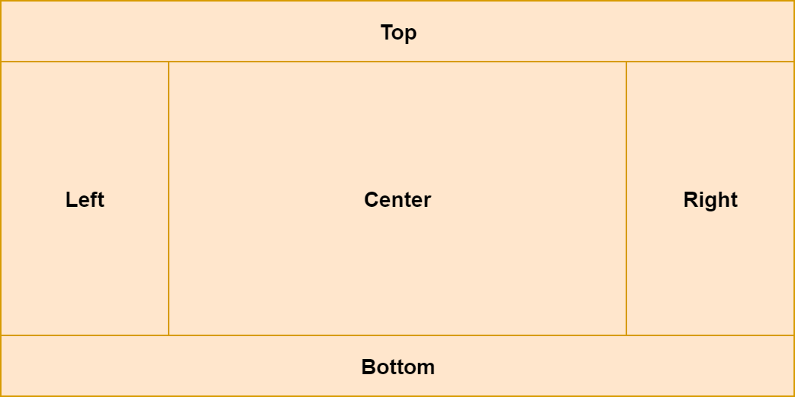

How to organize and position your GUI components in JavaFX application using advanced layouts.

In the previous article [we covered some basic JavaFX layouts](/javafx-layouts-basic). Now it's time to go through the rest of the available layouts.

## AnchorPane

## GridPane

## BorderPane
BorderPane is a layout with five sections:
- Top
- Bottom
- Right
- Left
- Center



You can assign conponents to individual sections of the BorderPane:

```xml

<BorderPane>
    <top>
        <Label>TOP</Label>
    </top>
    <bottom>
        <Label>BOTTOM</Label>
    </bottom>
    <left>
        <Label>LEFT</Label>
    </left>
    <right>
        <Label>RIGHT</Label>
    </right>
    <center>
        <Label>CENTER</Label>
    </center>
</BorderPane>
```

Now the same example in Java:

```java
Label top = new Label("TOP");
Label bottom = new Label("BOTTOM");
Label left = new Label("LEFT");
Label right = new Label("RIGHT");
Label center = new Label("CENTER");

BorderPane borderPane = new BorderPane();
borderPane.setTop(top);
borderPane.setBottom(bottom);
borderPane.setLeft(left);
borderPane.setRight(right);
borderPane.setCenter(center);
```

### Sizing
All the regions except the center have the fixed size. Center then fills rest of the space.

Top and Bottom regions are stretched across all the available horizontal space. Their height is based on the height of the component inside.

Left and right fill all the available vertical space (except what's occupied by top and bottom). Their width is dependent on width of the component inside.

Center has dynamic size and fills rest of the space not occupied by other sections. Let's look at an example:

 

## SplitPane

## TabPane