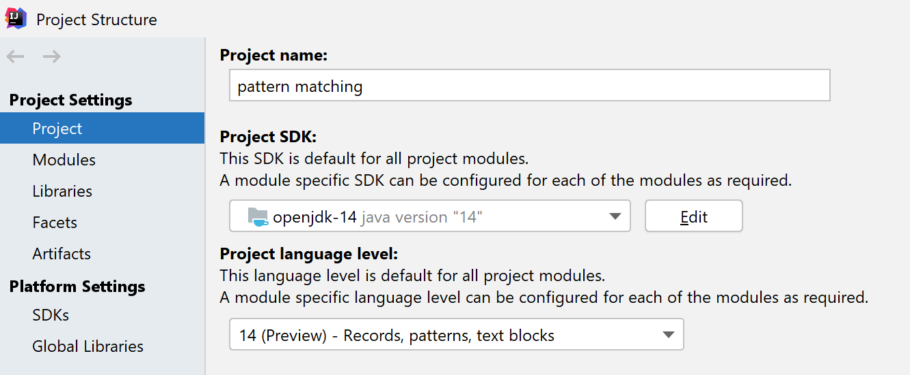

## instanceof
To better understand this new feature, let's look into how `instanceof` operator works. If you are already familiar with it, feel free to skip to the next section.

In short, it tests whether the given object is of the given type. Based on this, it returns either `true` or `false`.

```java
    if(animal instanceof Cat) {
      // It is a cat! Do something
    } else {
      // It is not a cat, do something else
    }
```

This returns `true` if your object is of the given type or its subtype. Otherwise, it returns false.

## Pattern matching for instanceof

### The good old way

Consider the following example. `Animal` is a class which has two subclasses: `Cat` and `Dog`.

```java
public String getAnimalSound(Animal animal) {
    if(animal instanceof Cat) {
        Cat cat = (Cat)animal;
        return cat.meow();
    } else if (animal instanceof Dog) {
        Dog dog = (Dog)animal;
        return dog.bark();
    }

    throw new UnknownAnimalException();
}
```

We get an animal as an input. If that animal is an instance of `Cat`, we want to get that cat to meow. If it is a dog, we need it to bark. Since these methods are not on `Animal` class, but rather on its subclasses, we need to:

1. First, check what type of animal we have using `instanceof`.
2. Create a new variable of type `Cat` or `Dog`.
3. Cast our animal to the proper type.

Now we can use our cat or dog. Variation of this can be pretty common.

The code does its job, but it is unnecessarily verbose. We usually want to do all the steps above. The casting is unnecessary as we already checked with `instanceof` that we have either `Cat` or `Dog`.

Fortunately, Java 14 introduced a new feature called *Pattern matching for instanceof* described in [JEP 305](https://openjdk.java.net/jeps/305). It is currently a preview feature, so it  may change in a future release.

### The better way
In Java 14, the example above can be simplified.

```java
// Before Java 14
if(animal instanceof Cat) {
    Cat cat = (Cat)animal;
    return cat.meow();
}

//After
if(animal instanceof Cat cat) {
    return cat.meow();
}
```

Here's what changed:
1. No need to declare cat variable, it is available for us.
2. There is no casting. We can use the cat as if it was of type `Cat`.
3. The scope of the`cat` variable is only inside the `if` block.

This is simpler, more concise, easier to read, and less error-prone.

#### Variable scope
As already mentioned, the scope of the variable is only limited to the `if` block:

```java
if(animal instanceof Cat cat) {
    return cat.meow();
} else {
    // Can't use cat here
}
// Can't use cat here either
```

However, you can use the variable inside the `if` condition, if you have more complicated conditions, such as with AND/OR.

```java
if(animal instanceof Cat cat && cat.isAlive()) {
    return cat.meow();
}
```

After checking `instanceof`, after `&&`, we can use the `cat` variable already typed as `Cat`, not `Animal`.

## IDEA Support
The good news is that there is good support for this feature in IntelliJ IDEA, introduced in version [2020.1](https://blog.jetbrains.com/idea/2020/03/java-14-and-intellij-idea/) (along with support for other Java 14 new features, such as [Records](https://www.vojtechruzicka.com/java-records/) or [Enhanced Switch](https://www.vojtechruzicka.com/java-enhanced-switch/))


## Try it yourself!
To try this feature yourself, you'll need to have [JDK 14 installed](https://jdk.java.net/14/). 

### Preview feature
Pattern matching for instanceof functionality is available in Java 14. However, currently only as a preview feature. What does it mean?

>A preview language or VM feature is a new feature of the Java SE Platform that is fully specified, fully implemented, and yet impermanent. It is available in a JDK feature release to provoke developer feedback based on real-world use; this may lead to it becoming permanent in a future Java SE Platform.
> 
>Before the next JDK feature release, the feature's "real world" strengths and weaknesses will be evaluated to decide if the feature has a long-term role in the Java SE Platform and, if so, whether it needs refinement. Consequently, the feature may be granted final and permanent status (with or without refinements), or undergo a further preview period (with or without refinements), or else be removed.

Such features are shipped in the JDK but are not enabled by default. You need to explicitly enable them to use them. Needless to say, it is not intended for production use, but rather for evaluation and experimentation as it may get removed or heavily changed in a future release.


### IntelliJ IDEA setup
In IntelliJ IDEA, you can enable preview features under `File → Project Structure`.



### Manual compilation
Alternatively, if building manually, you need to provide the following params to `javac`:

```
javac --release 14 --enable-preview ...
```

That is for compile-time. At run-time, you just provide `--enable-preview`

```
java --enable-preview ...
```

### Maven projects

For Maven builds, you can use the following configuration:

```xml
<build>
    <plugins>
        <plugin>
            <artifactId>maven-compiler-plugin</artifactId>
            <configuration>
                <release>14</release>
                <compilerArgs>
                    --enable-preview
                </compilerArgs>
                <source>14</source>
                <target>14</target>
            </configuration>
        </plugin>
        <plugin>
            <artifactId>maven-surefire-plugin</artifactId>
            <configuration>
                <argLine>--enable-preview</argLine>
            </configuration>
        </plugin>
        <plugin>
            <artifactId>maven-failsafe-plugin</artifactId>
            <configuration>
                <argLine>--enable-preview</argLine>
            </configuration>
        </plugin>
    </plugins>
</build>
```

## Also new in Java 14

- [Records](https://www.vojtechruzicka.com/java-records/)
- [Enhanced Switch](https://www.vojtechruzicka.com/java-enhanced-switch/)
- [Text Blocks](https://www.vojtechruzicka.com/java-text-blocks/)
